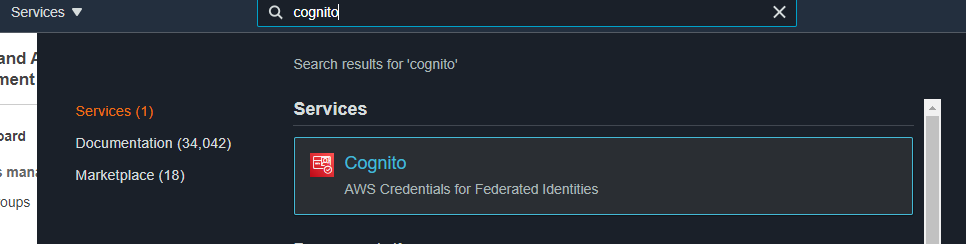
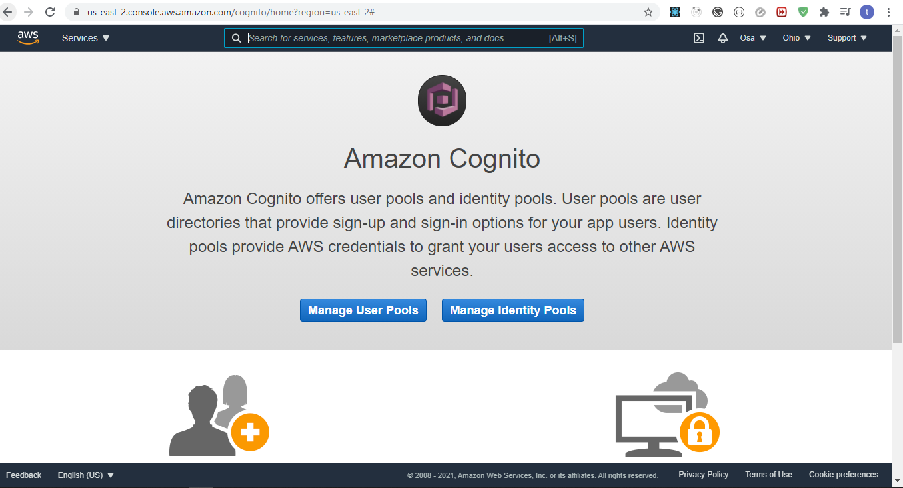
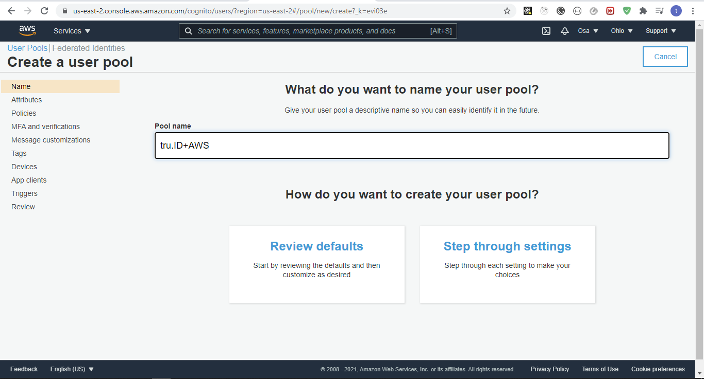
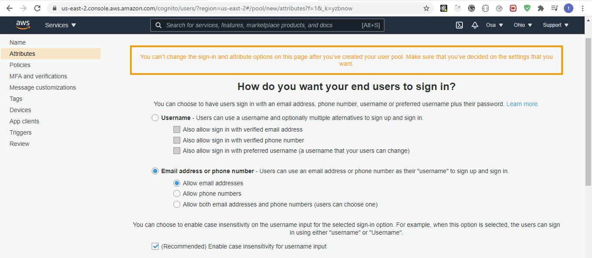
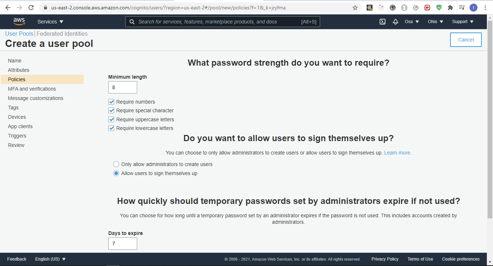
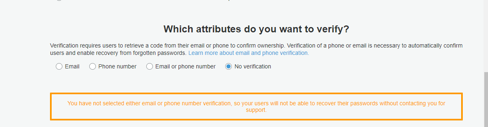
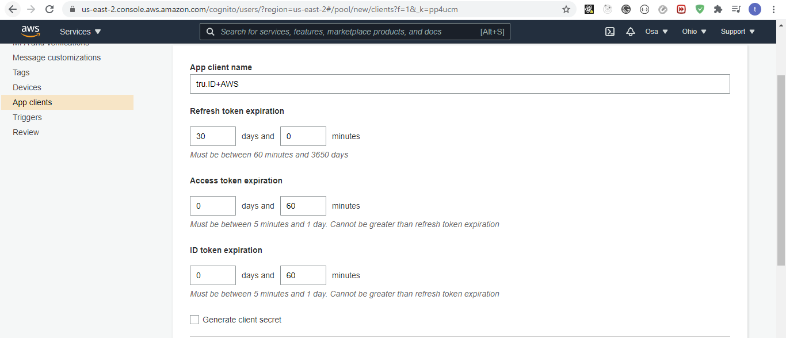
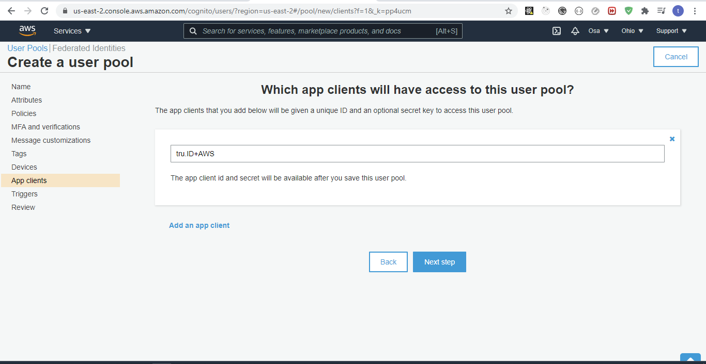

# Adding SIM Swap Detection to your React Native AWS Apps with Amazon Cognito & **tru.ID** PhoneCheck API

## Requirements

- A [tru.ID Account](https://tru.id)
- An [AWS Account](https://console.aws.amazon.com)
- A mobile phone with a SIM card and mobile data connection
- Other requirements

## Getting Started

Clone the starter-files branch via:

```bash
git clone -b starter-files --single-branch https://github.com/tru-ID/amazon-cognito-sim-swap-detection.git
```

If you're only interested in the finished code in main then run:

git clone -b main https://github.com/tru-ID/amazon-cognito-sim-swap-detection.git

Create a [tru.ID Account](https://tru.id)

Install the tru.ID CLI via:

```bash
npm i -g @tru_id/cli

```

Input your **tru.ID** credentials which can be found within the tru.ID [console](https://developer.tru.id/console)

Install the **tru.ID** CLI [development server plugin](https://github.com/tru-ID/cli-plugin-dev-server)

Create a new **tru.ID** project within the root directory via:

```
tru projects:create rn-amazon-auth
```

Run the development server, pointing it to the directly containing the newly created project configuration. This will also open up a localtunnel to your development server making it publicly accessible to the Internet so that your mobile phone can access it when only connected to mobile data.

```
tru server -t --project-dir ./rn-amazon-auth
```

## Setting up Amazon Cognito

Create or log into an [AWS account](https://console.aws.amazon.com)

Navigate to the AWS Management portal

Search for cognito, and select the service as shown below.


You'll be taken to the following page, select "manage user pools" & create a new user pool.


Give the pool a name and select "step through settings" as shown below.


Under "attributes" select "Email address or phone number" as shown below


Under the "Which standard attributes do you want to require?" heading select "phone number" click "Next Step" to continue

Under "policies" keep the defaults, as shown below


Under "MFA and verifications" keep the defaults except under the "Which attributes do you want to verify?" heading. There, select "no verification" as shown below


Under "Message customizations" keep the defaults and proceed to the next step

Under "Tags" simply proceed to the next step

Under "devices" keep the default and proceed to the next step

Under "App clients" click "Add an app client". Give the App client name a name and ensure to uncheck the "Generate client secret" checkbox because the AWS SDK [doesn't support apps that have a client secret](https://github.com/aws-amplify/amplify-js/tree/master/packages/amazon-cognito-identity-js#configuration) as shown below.


Below, under Auth Flows Configuration ensure to check the "Enable username password based authentication (ALLOW_USER_PASSWORD_AUTH)"

You will then be informed that you have added an app client, as shown below, click "Next Step" to proceed.


Under "Triggers" leave the defaults and proceed to the next step

Finally, under "Reviews" you will be shown a recap of all your settings and allowed to modify them and create the pool. Once you've looked over your settings create the pool. An example is shown below.


You should then be given a `Pool id` & `Pool ARN`. Open the terminal and run the following

```bash
cp .env.example .env
```

Replace `AMAZON_USER_POOL_ID` with the `Pool id` value and `AMAZON_CLIENT_ID` with the `Pool ARN` value.

To start the project, ensure you have a physical device connected (see Running React Native on a physical device guide ) then run:

```bash
npm run android
#or
npm run ios
```

## References

- [**tru.ID** docs](https://developer.tru.id/docs)
- [Amazon Cognito Identity GitHub repo](https://github.com/aws-amplify/amplify-js/tree/master/packages/amazon-cognito-identity-js)

## Meta

Distributed under the MIT License. See [LICENSE](https://github.com/tru-ID/amazon-cognito-sim-swap-detection/blob/main/LICENSE.md)

[**tru.ID**](https://tru.id)
